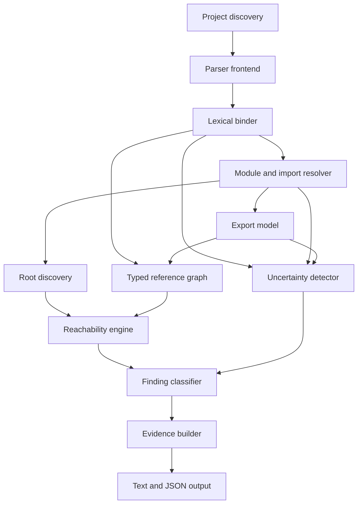
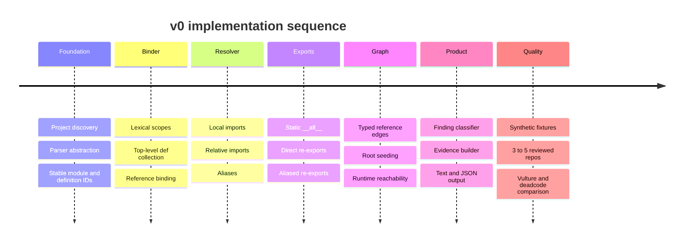

# v0 Engineering Specification

Document type: engineering specification  
Status: frozen v0 scope  
Audience: implementation, benchmark, and product decisions  
Last updated: 2026-06-24

## Purpose

Cull v0 is a Rust CLI that finds top-level Python functions and classes that are unused under
Cull's static model.

The first release is intentionally narrow. It exists to prove that project-wide symbol identity,
import resolution, export modeling, and root reachability can produce more trustworthy dead-code
findings than name-based tools.

## Product Claim

Cull identifies unreferenced and root-unreachable top-level Python functions and classes, explains
every finding with a static evidence trail, and achieves higher precision than Vulture and deadcode
at useful, measured recall.

At the default reporting threshold, Cull should beat Vulture and deadcode on precision while
retaining comparable recall. At the high-confidence threshold, Cull should optimize for near-zero
false positives and report recall separately.

## Non-Goals

Cull v0 does not analyze methods, nested functions, unused modules, unused dependencies,
dependency-to-import package mappings, autofix, runtime traces, full type inference, full call
graphs, broad framework plugins, native extensions, or LLM-based analysis.

Cull v0 does not claim that code is universally or provably dead. Findings mean unused under Cull's static model.

## Core Invariants

These rules are non-negotiable for v0.

**Reachable modules do not imply reachable definitions.**  
Reaching a module does not make its top-level definitions live.

**Type-only references are distinct from runtime reachability.**  
Type-only references prevent unreferenced findings, not runtime reachability findings.

**Dynamic behavior reduces confidence.**  
Dynamic imports, reflection, dynamic exports, unknown decorators, and similar patterns downgrade or
suppress findings.

**Public library APIs are conservative by default.**  
Library mode does not report exported or public top-level definitions as safely removable by default.

**Evidence is required for every finding.**  
A diagnostic without a static evidence trail is not valid output.

## Definitions

| Term | Definition |
|---|---|
| Definition | A top-level Python `def` or `class` that Cull can assign a stable identity. |
| Reference | A resolved use of a definition through a typed graph edge. |
| Unreferenced | No statically resolved inbound reference points to the definition. |
| Root-unreachable | No runtime-reachability path exists from any recognized project root to the definition. |
| Root | A configured or discovered entry point that can make runtime code live. |
| Export | A symbol exposed through static `__all__`, package re-export, alias re-export, or package public binding. |
| Static evidence trail | The structured explanation for why Cull produced, downgraded, or suppressed a finding. |

## Supported Project Shape

Cull v0 targets normal Python projects, especially `src/` layouts.

The project loader should support:

- explicit `src` values from `[tool.cull]`
- conventional `src/` layouts
- simple flat package layouts
- Python files filtered by excludes
- package `__init__.py` files
- local namespace-package portions when local resolution requires them

The source tree is authoritative for project-local resolution. Environment metadata is not required
for v0.

Project-local module providers are resolved by ordered path-entry search. For each source root or
package path entry in order, Cull checks for a regular package, then a module file, then records a
namespace-package portion. The first concrete package or module provider wins immediately.
Namespace-package portions are combined only when the complete ordered search finds no concrete
provider. Environment paths, zip providers, native modules, import hooks, and dynamically modified
package paths are not simulated in v0; they become explicit uncertainty.

## Operating Modes

Cull defaults to `auto` mode. The default must not infer a closed-world application assumption from
weak heuristics.

### Auto Mode

Auto mode is the default trust-first policy for projects that have not declared application or
library semantics.

| Surface | v0 Behavior |
|---|---|
| private top-level definitions | May be high-confidence findings when evidence supports it. |
| public top-level definitions | At most `Review`. |
| exported definitions | Conservative; at most `Review` unless an explicit mode allows stronger output. |

### Application Mode

Application mode is an explicit closed-world policy for executable application code. Public and
private top-level definitions may be high-confidence findings when static evidence supports it.

Recognized roots in v0 are:

| Root Source | Scope |
|---|---|
| configured roots | Explicit symbols such as `acme.cli:main`. |
| `[project.scripts]` | Console script targets from `pyproject.toml`. |
| `[project.gui-scripts]` | GUI script targets from `pyproject.toml`. |
| `if __name__ == "__main__"` | Top-level references inside modules that contain a main guard. |
| test roots | Optional. Enabled only when configured or invoked in a test profile. |

Cull traverses top-level executable references in recognized root modules. It does not mark every
definition in those modules as reachable merely because the module is a root.

### Library Mode

Library mode assumes external consumers may use public APIs that are not referenced inside the repository.

The default policy is conservative:

| Surface | v0 Behavior |
|---|---|
| static `__all__` exports | Live export references. |
| direct package re-exports | Live export references. |
| aliased re-exports | Live export references. |
| public bindings in package `__init__.py` | Live public surface references. |
| public top-level definitions | Not reported as safely removable by default. |
| private top-level definitions | Analyzed normally. |
| dynamic exports | Suppress or downgrade affected findings. |

Library findings may say unused within this repository. They should not imply safe removal unless
the evidence supports that claim.

### Definition Surface Classification

Cull classifies top-level function and class definitions using this precedence:

1. Explicitly exported.
2. Recognized module protocol hook.
3. Special dunder.
4. Private.
5. Public.

Policy:

| Surface | v0 Behavior |
|---|---|
| exported | A definite export is an inbound export reference and prevents `CULL001`/`CULL002` independently of project mode. |
| recognized module protocol hook | Non-reportable in v0. Examples include top-level `__getattr__` and `__dir__`. |
| special dunder | At most `Review` in every mode for v0. |
| private | A leading single underscore, excluding dunder names. May be high confidence when other evidence supports it. |
| public | A name without a leading underscore. Mode controls confidence for public-but-not-exported definitions. |

Export evidence overrides spelling. An explicitly exported underscore name is still exported.
Public bindings in package `__init__.py` are package public surface in `auto` and `library` modes.
Mode only affects public-but-not-exported definitions and finding confidence.

## Architecture



The parser is replaceable and isolated behind Cull-owned types. Ruff-aligned crates are the
preferred frontend if vendoring is acceptable. `rustpython-parser` is the fallback. Tree-sitter is
not the v0 semantic frontend.

## Data Model

### Definition Identity

The analysis engine compares interned IDs, not strings.

```text
DefId = ModuleId + DefinitionKind + Name + SpanStart + SpanEnd
```

Human-readable names are display values only.

```text
acme.cache::_decode_legacy_key
acme.models::LegacyUser
```

`DefId` is deterministic within a single project snapshot. It is not intended to remain stable across edits in v0.

### Definition Kinds

| Kind | Reported in v0 |
|---|---|
| TopLevelFunction | Yes |
| TopLevelClass | Yes |
| Method | No |
| NestedFunction | No |
| ImportBinding | No, but used in resolution. |
| AliasBinding | No, but used in resolution. |
| ReExport | No, but used in export modeling. |

### Reference Edge Types

Typed edges are required because not all references imply the same liveness.

| Edge Type | Prevents Unreferenced | Establishes Runtime Reachability |
|---|---:|---:|
| runtime-reference | Yes | Yes, if source is runtime-reachable. |
| import-reference | Yes | No by itself. |
| export-reference | Yes | Mode-dependent. Live in library mode. |
| decorator-reference | Yes | Yes for the referenced decorator. Unknown decorator effects may add uncertainty. |
| base-class-reference | Yes | Yes for the referenced base class. |
| type-only-reference | Yes | No. |
| configured-root-reference | Yes | Yes. |

The graph must preserve edge type in diagnostics.

## Analysis Pipeline


### 1. Project Discovery

Cull discovers Python files, source roots, package roots, excludes, and `pyproject.toml` metadata.

Discovery must be deterministic. Output ordering should be stable by file path, span, and rule ID.

### 2. Parser Frontend

The frontend parses Python source into an AST with accurate source ranges. It should support the
Python versions selected by configuration or inferred from project metadata when available.

Parser-specific structures must not leak into the core graph. The core graph owns Cull's durable types.

### 3. Binder

The binder builds lexical scopes and assigns stable identities to definitions.

It must handle:

| Feature | Requirement |
|---|---|
| lexical scopes | Modules, functions, classes, and necessary nested scopes for reference resolution. |
| shadowing | Same names in different scopes resolve to distinct bindings. |
| `global` and `nonlocal` | Required for correct reference resolution. |
| aliases | Import and assignment aliases participate in binding. |
| duplicate names | Distinct source spans create distinct identities. |
| closures | Supported enough to resolve references that affect top-level definitions. |

Cull may ignore nested functions and methods as reportable definitions, but it still needs enough
scope information to resolve references inside them.

### 4. Module and Import Resolver

The resolver maps imports to project-local modules, external modules, unresolved modules, or ambiguous modules.

It must support:

| Import Form | v0 Requirement |
|---|---|
| `import pkg.mod` | Resolve local module when present. |
| `import pkg.mod as alias` | Bind alias to module. |
| `from pkg import name` | Resolve module member, submodule, or export. |
| `from pkg import name as alias` | Bind alias to resolved target. |
| `from .mod import name` | Resolve relative imports from package context. |
| star import | Add uncertainty unless statically resolved through literal `__all__`. |

Unknown module resolution should attach uncertainty instead of producing confident findings.

Import and alias resolution must attach module or value provenance to concrete `BindingId`s and use
Part 1 reaching-binding results. Cross-module references are not created from raw-name matching.
Cross-module reference facts preserve local may-execution, phase, production/test origin,
type-only/lazy-annotation classification, and flow uncertainty. Locally unreachable references do
not create inbound edges; references in dormant function bodies still count for unreferenced analysis
because root reachability is separate.

Loading a submodule creates an attribute on its parent package, but Cull models that as a synthetic
namespace binding event rather than a timeless fact. The event participates in the same ordered or
conservative module-namespace state as package assignments, imports, re-exports, module attribute
resolution, and `__all__` slot resolution. When Cull cannot prove the execution order, it preserves
all possible slot bindings and attaches partial-initialization or order uncertainty.

### 5. Export Model

Minimal v0 export support includes:

| Export Pattern | v0 Behavior |
|---|---|
| `__all__ = ["A", "b"]` | Static export references for listed names when the assignment reaches module exit. |
| `__all__ = ("A", "b")` | Static export references for listed names when the assignment reaches module exit. |
| `from .models import User` in `__init__.py` | Direct package re-export. |
| `from .models import User as PublicUser` | Aliased re-export. |
| public binding in package `__init__.py` | Public package surface in library mode. |
| dynamic `__all__` construction | Suppress or downgrade affected export-sensitive findings. |

The export model is required in v0 because library mode depends on it.

`__all__` is derived from module-exit state, not from every syntactic assignment. Multiple reaching
literal list or tuple assignments are unioned conservatively. Unsupported flow, dynamic mutation,
dynamic construction, or partially unresolved entries become export uncertainty and fail closed for
findings they could invalidate. Export references target module public-name slots or symbols, not
point-in-time bindings; slot resolution then determines possible binding or definition targets.

### 6. Root Discovery

Root discovery creates configured-root references and identifies root modules whose top-level
executable references should be traversed.

Root discovery must not create blanket edges from a root module to every top-level definition inside that module.

### 7. Reachability Engine

Runtime reachability starts from recognized roots and follows runtime-capable edges.

The engine follows:

- configured-root-reference
- runtime-reference from a runtime-reachable source
- decorator-reference to the decorator object
- base-class-reference to the base class
- selected export-reference edges in library mode

The engine does not follow type-only-reference edges for runtime reachability.

The engine does not mark a definition live just because its containing module is reachable.

### 8. Uncertainty Detector

Uncertainty suppresses or downgrades findings when static conclusions are weak.

Initial uncertainty sources:

| Pattern | Policy |
|---|---|
| `eval` or `exec` | Downgrade or suppress affected module findings. |
| dynamic `getattr` or `setattr` | Downgrade when names or receiver are relevant or unknown. |
| variable-driven `importlib` calls | Downgrade import and reachability findings. |
| star imports | Downgrade unless resolved through static `__all__`. |
| dynamic `__all__` | Suppress or downgrade export-sensitive findings. |
| unproven package-attribute order or circular partial initialization | Preserve possible targets and downgrade affected findings. |
| monkey-patching patterns | Downgrade affected module or symbol area. |
| unknown decorators | Downgrade decorated definitions or referenced targets as appropriate. |
| unresolved local imports | Downgrade affected findings. |
| ambiguous or environment-dependent namespace providers | Mark environment-dependent or review. |

The uncertainty model should be visible in output. Hidden uncertainty is a bug.

## Finding Rules

| Rule | Name | Applies To |
|---|---|---|
| CULL001 | unreferenced-function | Top-level functions. |
| CULL002 | unreferenced-class | Top-level classes. |
| CULL003 | unreachable-function | Top-level functions. |
| CULL004 | unreachable-class | Top-level classes. |

A definition may qualify as both unreferenced and root-unreachable internally. Output should avoid
redundant diagnostics by choosing the most useful primary finding and including the secondary
condition in evidence.

Recommended priority:

1. Unreferenced, when there are no inbound references.
2. Root-unreachable, when inbound references exist but no runtime path exists from roots.

## Confidence Labels

Cull v0 uses categorical labels, not numeric scores.

| Label | Meaning |
|---|---|
| High confidence | Static evidence is strong and no relevant uncertainty is detected. |
| Review | Static evidence suggests unused, but uncertainty or mode policy prevents a stronger claim. |
| Suppressed due to uncertainty | Cull identified a candidate but should not report it as an actionable finding. |

Numeric confidence is out of scope until empirical calibration exists.

## Evidence Model

Every diagnostic must include:

| Field | Meaning |
|---|---|
| rule_id | Stable rule ID such as `CULL001`. |
| finding_type | `unreferenced` or `root_unreachable`. |
| definition | Name, kind, module, file, and span. |
| confidence | Categorical confidence label. |
| inbound_references | Count and typed summary. |
| reachability | Root traversal result. |
| exports | Export status and source. |
| mode_effect | Auto, application, or library policy effect. |
| uncertainty | Dynamic or unresolved factors. |
| explanation | Human-readable evidence trail. |

Example JSON:

```json
{
  "rule_id": "CULL003",
  "finding_type": "root_unreachable",
  "definition": {
    "kind": "top_level_function",
    "name": "old_entry",
    "qualified_name": "acme.legacy::old_entry",
    "file": "src/acme/legacy.py",
    "line": 12,
    "column": 1
  },
  "confidence": "high",
  "inbound_references": [
    {
      "edge_type": "runtime-reference",
      "source": "acme.legacy::old_helper",
      "file": "src/acme/legacy.py",
      "line": 30
    }
  ],
  "reachability": {
    "reachable_from_roots": false,
    "recognized_roots": ["console_script:acme"]
  },
  "exports": [],
  "uncertainty": [],
  "explanation": [
    "definition has inbound references, so it is not unreferenced",
    "no runtime path exists from recognized roots",
    "containing module reachability was not treated as definition reachability",
    "no dynamic-access uncertainty affected this definition"
  ]
}
```

Example text output:

```text
src/acme/legacy.py:12:1 CULL003 root-unreachable-function
Function `old_entry` is root-unreachable under Cull's static model.

Confidence: high

Evidence:
- has 1 inbound runtime reference from acme.legacy::old_helper
- no runtime path exists from recognized roots
- recognized roots: console_script:acme
- containing module reachability did not make this definition reachable
- no relevant uncertainty detected
```

Default text output shows high-confidence findings only. `Review` findings are available in JSON.
Suppressed candidates remain internal/debug output. Part 2 does not include a human-facing
`--show-review` option.

## CLI and Configuration

Initial commands:

```bash
cull check .
cull check . --format json
cull check . --mode application
cull explain acme.cache::_decode_legacy_key
```

Exit codes:

| Code | Meaning |
|---|---|
| 0 | No default-visible high-confidence findings. |
| 1 | One or more default-visible high-confidence findings. |
| 2 | Configuration, project discovery, decoding, parsing, or analysis failure. |

Initial configuration:

```toml
[tool.cull]
mode = "auto"
src = ["src"]
tests = ["tests"]
exclude = ["migrations"]

roots = [
  "acme.cli:main",
]
```

Test roots should be opt-in through configuration or a dedicated test profile. Test-only references
should be distinguishable in the graph so production-dead code is not silently hidden.

## Benchmark Plan

Benchmarking is part of the product. The benchmark must prevent silence bias, where a tool appears
precise by reporting almost nothing.

### Prototype Benchmark

The prototype benchmark includes synthetic fixtures and 3 to 5 manually reviewed repositories.

Synthetic fixtures should cover:

| Fixture Area | Examples |
|---|---|
| scope identity | Same-name definitions across modules and scopes. |
| imports | Absolute imports, relative imports, aliases, unresolved imports. |
| exports | Static `__all__`, direct re-exports, aliased re-exports, dynamic exports. |
| modes | Application and library behavior. |
| roots | Console scripts, main guards, configured roots. |
| references | Runtime, type-only, decorator, base-class, import, export. |
| dead clusters | Internally referenced but root-unreachable definitions. |
| uncertainty | `getattr`, `setattr`, `eval`, `exec`, star imports, unknown decorators. |

### Beta Benchmark

The beta benchmark expands to a larger independently labeled corpus, historical dead-code removal
commits, seeded dead-code mutations, and precision-recall comparisons.

### v1 Benchmark

The v1 benchmark becomes a reproducible harness with stable datasets, regression tracking, runtime
and memory gates, and published methodology.

### Metrics

| Metric | Purpose |
|---|---|
| precision | Main trust metric. |
| recall | Prevents silence bias. |
| F1 | Aggregate comparison. |
| high-confidence false positives | Headline trust gate. |
| findings per repository | Measures noisiness. |
| suppressed findings | Measures uncertainty impact. |
| runtime | Local and CI practicality. |
| peak memory | Scalability. |

## v0 Acceptance Criteria

Cull v0 is ready when it can:

1. Analyze a normal `src/`-layout Python project.
2. Resolve ordinary scopes, imports, aliases, and re-exports.
3. Distinguish exact top-level definitions with identical names.
4. Model static `__all__`, direct re-exports, aliased re-exports, and package public bindings.
5. Discover configured roots, script roots, GUI script roots, and main-guard roots.
6. Build typed reference edges, including type-only edges.
7. Report unreferenced top-level functions and classes.
8. Report root-unreachable top-level functions and classes.
9. Preserve the invariant that reachable modules do not imply reachable definitions.
10. Suppress or downgrade known uncertainty cases.
11. Explain every finding with a static evidence trail.
12. Produce deterministic text and JSON output.
13. Beat Vulture and deadcode on precision at comparable recall in the benchmark.
14. Complete analysis fast enough for routine local and CI use.

## Deferred Work

The following work is intentionally deferred until after v0:

| Area | Earliest Phase |
|---|---|
| richer framework roots | Beta or v1 |
| SARIF output | Beta |
| baselines and suppressions | Beta |
| cache and incremental invalidation | Beta |
| methods | Post-v0 |
| nested functions | Post-v0 |
| unused modules | Post-v0 |
| dependency cleanup | Post-v0 |
| import-to-distribution mapping | Post-v0 |
| runtime tracing | v1 or later |
| autofix | v1 or later, high-confidence only |
| editor integration | v1 or later |

## Implementation Sequence



The implementation should optimize for correctness and explainability before speed. Rust performance
matters, but trust is the v0 product.
