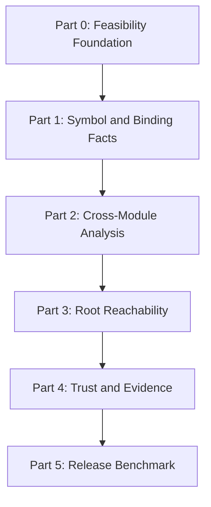

# v0 Implementation Plan

Document type: implementation plan  
Status: build sequence for frozen v0 scope  
Audience: implementation, review, benchmarking, and release decisions  
Last updated: 2026-06-24

## Purpose

This document describes how to build v0 in reviewable parts. The frozen engineering specification
at `docs/v0-engineering-specification.md` remains the product contract. It defines what v0 means,
what it reports, and what is excluded.

This implementation plan defines the build order and the internal semantic model needed to reach
that product contract. If this document and the engineering specification disagree, the
specification controls product behavior. A conflict that changes product meaning requires an
explicit specification amendment.

## Executive Summary

v0 remains narrow: report top-level Python functions and classes that are unreferenced or
root-unreachable under Cull's static model. It does not report methods, nested functions, unused
modules, unused dependencies, or autofixes.

The implementation is deeper than a simple AST scan because Python binding and annotation semantics
can otherwise create false confidence. Cull must distinguish lexical name slots, binding events,
and reportable definitions; resolve references to possible reaching bindings; model execution
contexts separately from scopes; and treat uncertainty as structured evidence.

The build sequence is capability-based:

```text
Part 0  Feasibility and semantic foundation
Part 1  Symbol and binding facts
Part 2  Cross-module analysis and first public findings
Part 3  Root reachability
Part 4  Trust, evidence, and product hardening
Part 5  Release benchmark
```

Normal public `CULL001` and `CULL002` findings begin only after Part 2, once imports, exports, and
library policy are modeled. Part 1 may produce fixture-only or debug-only candidates, but not
normal high-confidence project-wide claims.

## Product Boundary

Cull v0 reports:

- `CULL001` unreferenced top-level function
- `CULL002` unreferenced top-level class
- `CULL003` root-unreachable top-level function
- `CULL004` root-unreachable top-level class

Cull v0 deliberately excludes:

- method findings
- nested-function findings
- unused-module findings
- unused-dependency findings
- dependency-to-import package mapping
- broad framework plugins
- runtime tracing
- autofix
- full type inference
- full call-graph construction
- LLM-based analysis

Methods and nested functions may still be indexed when needed to resolve references to reportable
top-level definitions.

## Capability Sequence



Each part must land with fixtures, deterministic output, and a short implementation note. Deferred
features stay deferred while completing these parts.

## Repository Shape

Start with a small Rust workspace.

```text
crates/
  cull-cli/
  cull-core/
  cull-python/
```

`cull-cli` owns commands, configuration, orchestration, output formatting, JSON serialization, and
exit codes.

`cull-python` owns source discovery, Python project layout, parser adapters, lowering, Python
scope classification, Python-specific binding semantics, local module resolution, annotation
semantics, and dynamic-pattern detection.

`cull-core` owns typed IDs, arenas, semantic facts, references, resolutions, execution contexts,
reachability, uncertainty, findings, and evidence.

Do not split into more crates until compile time, ownership boundaries, or reuse justify it.

## Foundational Decisions

These decisions are part of the v0 build contract.

| Decision | v0 Direction |
|---|---|
| Parser boundary | Use a parser-neutral Cull IR. Parser-specific types cannot cross into `cull-core`. |
| Parser frontend | Run an explicit Ruff viability gate, then compare against `rustpython-parser`. |
| Source decoding | Decode Python source at the boundary and store canonical UTF-8 internally. |
| Source ranges | Store canonical UTF-8 byte ranges; derive line and column positions lazily. |
| Dense IDs | Use compact interned IDs backed by deterministic arenas. |
| Identity model | Keep `SymbolId`, `BindingId`, and `DefId` separate. |
| Binder | Use a two-pass binder plus conservative reaching-binding sets. |
| Scopes and contexts | Separate lexical scopes from execution contexts. |
| Target version | Separate grammar coverage, semantic support, and product support. |
| Resolution | Use explicit resolved, ambiguous, external, and unresolved states. |
| Partial analysis | Fail closed by default when included project files cannot be analyzed. |
| Ordering | Sort inputs before interning and output; hash-map iteration never determines behavior. |
| Uncertainty | Attach uncertainty to the narrowest defensible region. |
| Evidence | Build evidence from stored analysis facts, not reconstructed prose. |
| Benchmarks | Require a non-vacuous release gate with precision and recall. |

The actual parser frontend remains undecided until the end of Part 0.

For non-UTF-8 source files, byte ranges refer to Cull's decoded canonical UTF-8 source, not the
original on-disk byte positions. This is acceptable for v0 because Cull does not edit files.

The current candidate semantic matrix is Python 3.10 through 3.14. Part 0 may include Python 3.15
as a forward-compatibility canary, but the final product-support matrix depends on the release date
and proven semantic support.

## Core Semantic Model

### Identity

Cull uses three separate identity layers.

| ID | Meaning |
|---|---|
| `SymbolId` | A named slot in a lexical scope, such as `(scope, "handler")`. |
| `BindingId` | One concrete binding or rebinding event for a symbol. |
| `DefId` | A function or class definition associated with a binding. |

`DefId` may exist for methods and nested definitions when the semantic model needs them, but only
top-level function and class definitions are reportable in v0.

`BindingSetId` may be used to intern deterministic sets of `BindingId`s. It is a compact analysis
handle, not a fourth identity layer.

Use compact typed IDs during analysis. Keep separate display keys for output.

```text
DefinitionKey = ModuleKey + DefinitionKind + LexicalParent + Name + SourceRange
```

`DefId` is deterministic within a single project snapshot. It is not intended to remain stable
across edits in v0.

### Binding and Reaching Targets

Python bindings are ordered. Redefinitions, imports, assignments, and deletes can replace, shadow,
or remove earlier bindings. Cull must not treat a module as an unordered symbol table.

A reference first resolves lexically to a symbol slot. A separate reaching-binding analysis then
determines which binding events may occupy that slot when the reference can execute.

```rust
enum Resolution<T> {
    Resolved(T),
    Ambiguous(Vec<T>),
    External,
    Unresolved(UnresolvedReason),
}
```

The lexical target and runtime binding state are intentionally separate.

```rust
enum LookupSemantics {
    Direct,
    GlobalThenBuiltin {
        global_symbol: SymbolId,
    },
    ClassLocalThenGlobalThenBuiltin {
        class_symbol: SymbolId,
        global_symbol: SymbolId,
    },
}

enum ReferenceBindingState {
    NotApplicable,
    Analyzed(BindingState),
    NotAnalyzed(FlowFailureReason),
}

struct BindingState {
    reachability: LocalReachability,
    bindings: BindingSetId,
    residual: ResidualLookup,
    uncertainty: FlowUncertaintySetId,
}

enum LocalReachability {
    MayExecute,
    Unreachable,
}

enum ResidualLookup {
    None,
    UnboundLocal,
    RuntimeGlobalThenBuiltin,
    RuntimeFreeVariable,
    BuiltinOrNameError,
}

enum ContextFlowStatus {
    Complete,
    Unsupported(FlowFailureReason),
}

enum CompletionKind {
    Normal,
    Return,
    Raise,
    Break(LoopId),
    Continue(LoopId),
}
```

`GlobalThenBuiltin` points to a real module `SymbolId` even when that symbol has no bindings yet.
`SymbolId` represents a lookup slot, not proof that a value is currently assigned.

`RuntimeGlobalThenBuiltin` and `RuntimeFreeVariable` preserve runtime lookup residuals independently
from concrete project `BindingId` candidates. Class body fallback is modeled through
`LookupSemantics::ClassLocalThenGlobalThenBuiltin`, because a class body first checks the class-local
namespace, then the module global namespace, then builtins.

Binding sets remain exact. Cull must not truncate candidates and add uncertainty, because an omitted
`BindingId` could later be treated as unreferenced. If an execution context exceeds analysis
resources, Cull marks that context `Unsupported`, sets affected references to `NotAnalyzed`, records
which budget was exceeded, and fails closed for later candidates or findings that depend on that
context.

`MayExecute` means the reference may execute on at least one modeled local path. It does not mean
the reference executes on every path.

Unresolved, ambiguous, residual runtime lookup, unbound behavior, uncertainty, or unsupported flow
analysis never silently becomes an unused finding.

Example:

```python
if condition:
    def handler():
        ...
else:
    def handler():
        ...

handler()
```

The final reference lexically targets `handler`. Its binding state may contain either definition.
Cull must preserve both possible bindings instead of arbitrarily choosing one.

### Binder and Flow Analysis

Use three conceptual stages.

Scope collection establishes lexical ownership and binding sites. It collects:

- bindings
- `global` declarations
- `nonlocal` declarations
- parameters
- assignments
- imports
- function and class definitions
- type parameters
- deletes
- lexical scopes

Lexical resolution uses the completed block information to resolve each name use to `SymbolId`,
`External`, or an explicit unresolved state.

The two-pass binder refers to scope collection and lexical resolution. Branches, loops, `try`,
`match`, deletion, exact binding sets, and resource-budget fail-closed behavior belong to a separate
intraprocedural flow engine.

Reaching-binding analysis must:

- preserve binding order
- preserve redefinition behavior
- compute conservative intraprocedural lookup states for references already resolved lexically
- preserve exact concrete project `BindingId` candidates
- record residual runtime lookup or unbound behavior separately from concrete candidates
- record local may-execution separately from lookup result
- record flow uncertainty without erasing known concrete candidates
- use conservative branch-aware reaching-binding sets
- mark a context unsupported and fail closed if exact analysis exceeds resource budgets
- preserve abrupt completion kinds from the initial CFG model: normal, return, raise, break, and
  continue

### Scopes and Execution Contexts

Scopes answer where names bind. Contexts answer when references may execute and whether runtime
reachability can propagate.

Minimum scope and context IDs:

```text
ScopeId
ContextId
```

Minimum execution contexts:

- module body
- function body
- class body
- lambda body when needed
- comprehension body when needed
- annotation context when required by the target Python version

Class scopes do not enclose method bodies. Annotation contexts may have special access to enclosing
class namespaces depending on target Python semantics.

`source_context` identifies where the referenced expression executes, not the AST node or definition
that syntactically contains it. Syntactic provenance can be added separately later if needed; it must
not change resolution semantics.

Execution-context ownership:

| Expression | `source_context` |
|---|---|
| function decorators and defaults | Enclosing context. |
| class decorators, bases, and keywords | Enclosing context. |
| function and lambda bodies | Their body context. |
| class suite statements | Class-body context. |
| leftmost comprehension iterable | Enclosing context. |
| remaining comprehension expressions | Comprehension context. |
| annotations | Deferred to Part 1D. |

Cull keeps semantic comprehension scopes even on Python versions where CPython inlines
comprehensions. Runtime frame allocation is not the same as lexical variable isolation.

### Reference Facts

References should carry orthogonal facts instead of relying on one expanding edge enum.

Each reference records:

```rust
struct ReferenceFact {
    id: ReferenceId,
    source_scope: ScopeId,
    source_context: ContextId,
    source_spelling: String,
    semantic_name: String,
    lexical_target: Resolution<SymbolId>,
    lookup: LookupSemantics,
    binding_state: ReferenceBindingState,
    phase: ReferencePhase,
    role: ReferenceRole,
    origin_domain: OriginDomain,
    span: TextRange,
}
```

Minimum phases:

- definition time
- body runtime
- type-only
- lazy annotation
- import time
- export surface
- root

Minimum roles:

- call
- value
- import
- module attribute
- export
- decorator
- default value
- annotation
- base class
- class keyword
- metaclass
- configured root

Minimum origin domains:

- production
- test
- generated or unknown, when needed

### Definition-Time Semantics

A function or class object can be unreferenced while its definition statement still performs work.

Definition-time references include:

- decorators
- default argument expressions
- eager annotations
- class base expressions
- class keyword arguments
- metaclass expressions
- class-body statements

Unusedness confidence and removal risk are separate.

A definition can be high-confidence unreferenced while its definition statement still has side
effects that make deletion risky. Those effects are represented in `definition_effects` and
`removal_risk` evidence. They do not by themselves make the function or class object referenced.

Unknown decorators, registration behavior, metaclasses, or similar effects may reduce liveness
confidence when they can plausibly make the definition reachable. Otherwise they reduce removal
confidence, not unusedness confidence.

Cull v0 does not promise safe deletion.

This preserves the core invariant:

```text
Reachable modules do not imply reachable definitions.
```

Executing a module creates function and class objects. It does not execute every function body or
make every contained definition reachable from a recognized root.

### Annotation Semantics

Annotation semantics are target-version-aware.

Cull models annotation evaluation per annotation site:

```rust
struct AnnotationSemantics {
    evaluation: AnnotationEvaluation,
    phase: ReferencePhase,
    scope: ScopeId,
}

enum AnnotationEvaluation {
    Eager,
    Stringified,
    Deferred,
    NeverEvaluated,
}
```

The model is determined from:

- configured target Python version
- inferred target Python version, when safe
- `from __future__ import annotations`
- annotation location and scope

Policy:

- eager annotations are definition-time references
- stringified annotations are type-only unless parsed and modeled more precisely
- deferred annotations are lazy-annotation references
- function-local variable annotations are never runtime-evaluated or stored
- `type Alias = ...` values are lazy from Python 3.12
- type-parameter bounds and constraints are lazy from Python 3.12
- type-parameter defaults are lazy from Python 3.13
- `if TYPE_CHECKING:` references are type-only
- uncertain annotation semantics downgrade affected conclusions

Do not treat all annotations as one uniform reference kind.

### Import, Export, and Root Resolution

Use explicit resolution states for imports, exports, roots, and similar analysis.

Project-local provider lookup is path-entry-first. For each ordered source root or package path entry,
check for a regular package, then a module file, then record a namespace-package portion. The first
concrete package or module provider wins. Local namespace-package portions are combined only if the
entire ordered search finds no concrete provider. Environment paths, zip providers, native modules,
import hooks, and dynamically modified package paths are explicit uncertainty, not simulated inputs.

Imports, aliases, literal dynamic-import return values, and module attribute chains must resolve from
`BindingId` provenance and Part 1 reaching-binding facts. Do not create cross-module references from
raw spelling matches. Cross-module references preserve local may-execution, phase, origin domain,
type-only/lazy-annotation classification, and uncertainty.

Loading a submodule creates a synthetic parent-package attribute, but Cull models it as a namespace
binding event rather than a timeless fact. When execution order is proven, the event participates in
ordered package namespace state. Otherwise Cull preserves all possible slot bindings and attaches
partial-initialization or order uncertainty.

Part 2B and Part 2C share one exact project namespace solver. Imports, package attributes, star
imports, and re-exports are mutually dependent; they must not be solved as unrelated passes with
conflicting candidate sets. The solver:

1. Resolves module-load requests.
2. Attaches module or value provenance to import `BindingId`s.
3. Seeds explicit module namespace slots.
4. Adds synthetic parent-package attribute binding events.
5. Resolves direct module attributes and from-import candidates.
6. Computes module-exit export surfaces.
7. Expands supported star imports into synthetic binding events.
8. Propagates direct and aliased re-exports.
9. Repeats until exact candidate sets stop changing.

Do not truncate target sets. If an SCC or project namespace region exceeds a resource budget, mark
the affected namespace analysis unsupported, preserve structured failure evidence, and fail closed
for findings that depend on it.

Supported v0 export patterns:

- literal list or tuple `__all__` from module-exit state
- direct package re-exports
- aliased package re-exports
- conservative public bindings in package `__init__.py`
- static star imports through known exports

`__all__` targets module public-name slots or symbols, not point-in-time bindings. If some module-exit
paths have an explicit literal `__all__` and other paths have no `__all__`, both the explicit names
and the implicit public surface are possible. Dynamic exports, unsupported `__all__` mutation,
unsupported module-exit flow, and partially unresolved export entries become uncertainty.

A definite export is an inbound export reference and prevents `CULL001`/`CULL002` independently of
project mode. Mode only affects public-but-not-exported definitions and finding confidence.

Supported v0 root sources:

- configured symbols
- `[project.scripts]`
- `[project.gui-scripts]`
- modules with recognized main guards
- optional test roots in a test profile

General `[project.entry-points]` groups remain post-v0 unless explicitly configured as roots.

### Root Coverage

Root-unreachable findings require credible roots.

```rust
enum RootCoverage {
    Complete,
    Partial,
    Absent,
    NotApplicable,
}
```

Policy:

| State | Policy |
|---|---|
| `Complete` | High-confidence root-unreachable findings are allowed. |
| `Partial` | Root-unreachable findings are at most `Review`. |
| `Absent` | Disable `CULL003` and `CULL004`; unreferenced analysis still runs. |
| `NotApplicable` | Library mode uses export and public-surface policy instead. |

`Complete` is narrow. Auto-discovered scripts and main guards do not prove all application roots are
known. A project reaches `Complete` only when the user explicitly asserts that configured roots are
complete, or when Cull has an equally strong closed-world condition. Otherwise root coverage remains
`Partial`.

### Mode Policy

Cull defaults to `auto` mode. Auto mode does not infer closed-world application semantics from weak
heuristics.

| Mode | Policy |
|---|---|
| `auto` | Private top-level definitions may be high confidence. Public top-level definitions and exported definitions are at most `Review`. |
| `application` | Public and private top-level definitions may be high confidence when evidence supports it. |
| `library` | Exported and public top-level definitions are conservative. Private top-level definitions are analyzed normally. |

The CLI may override configuration, for example `cull check . --mode application`.

Definition surface classification uses this precedence:

1. Explicitly exported.
2. Recognized module protocol hook.
3. Special dunder.
4. Private.
5. Public.

Recognized module protocol hooks such as top-level `__getattr__` and `__dir__` are non-reportable in
v0. Other top-level dunder function and class definitions are special and at most `Review` in every
mode. Leading single-underscore names are private unless they are dunder names. Export evidence
overrides spelling.

### Test-Domain Policy

Tests are indexed and tagged separately.

Default policy:

- test-only references prevent unreferenced findings because they are real references
- test roots do not establish production reachability
- candidates reachable only from tests say so in evidence
- a dedicated test profile may include test roots

### Partial Analysis Policy

Included source files that cannot be read, decoded, or parsed may contain references to any project
definition. Silent partial analysis would create false confidence.

Default policy:

- normal `cull check` exits with analysis failure when included project files cannot be analyzed
- explicit partial-analysis mode may continue
- in partial-analysis mode, affected findings are at most `Review`
- skipped files and reasons appear in project completeness evidence

### Uncertainty Model

Uncertainty is structural and local. It attaches to the narrowest defensible definition, execution
context, lexical scope, module, or project region.

One dynamic `getattr` or unknown decorator must not downgrade the entire project unless the
uncertainty truly has project-wide impact.

Initial uncertainty families:

- `eval` and `exec`
- dynamic `getattr`, `setattr`, `hasattr`, and `delattr`
- dynamic `globals`, `locals`, `vars`, and `dir`
- variable-driven dynamic imports
- unresolved star imports
- dynamic `__all__`
- module-level `__getattr__`
- dynamic package paths
- monkey patching
- unknown decorators
- subclass or metaclass registration behavior
- unresolved or ambiguous local imports
- environment-dependent namespace packages
- runtime annotation introspection that changes lazy-reference reachability

### Evidence Model

Evidence is a projection of stored analysis facts.

Edges, resolutions, root state, exports, mode effects, origin domains, definition effects, removal
risk, and uncertainty must carry enough information to render explanations later. Do not construct
explanations by reverse-engineering final diagnostics.

Default text output shows high-confidence findings only. `Review` findings remain available through
JSON or an explicit human-facing option. Suppressed candidates stay internal/debug-only so the
analysis is explainable without making the normal CLI noisy.

## Cross-Cutting Engineering Rules

### Determinism

- sort discovered paths before assigning IDs
- normalize relative paths against the project root
- never expose hash-map iteration order
- sort findings by path, span, rule, and finding ID
- run deterministic-output tests under randomized file-discovery order

### No Panics on User Input

Syntax errors, missing files, bad configuration, ambiguous imports, and unsupported encodings
produce structured diagnostics, not panics.

### Testing

Use:

- CPython `ast` and `symtable` as semantic oracles where applicable
- snapshot tests for text and JSON
- property tests for interning, ordering, and span round trips
- graph invariants, including monotonicity when roots are added
- fuzzing for parsing, lowering, and binder entry points

### JSON Contract

Only versioned JSON is the machine contract.

Text output must be deterministic but remains human-facing and may evolve. JSON includes a
`schema_version` field from its first public release.

### Explain Selectors

`cull explain` accepts a diagnostic or finding ID as the canonical selector.

Qualified symbol names are convenient aliases but may be ambiguous after redefinition. Ambiguous
selectors return candidates rather than selecting silently.

### Parallelism

Do not parallelize semantic construction until deterministic single-threaded behavior is stable.

Later, files may be parsed and lowered in parallel, then merged in deterministic module order.
Profiling determines further optimization.

### Rust Quality Gates

Minimum CI gates:

```text
cargo fmt --check
cargo clippy --workspace --all-targets --all-features -- -D warnings
cargo nextest run
snapshot verification
determinism check
CPython differential tests
```

Add dependency auditing and scheduled fuzzing before public v0.

## Part 0: Feasibility Foundation

### Goal

Choose the frontend, freeze semantic boundaries, discover projects deterministically, and establish
CPython-backed test oracles before semantic implementation begins.

### User-Visible Behavior

A hidden development command emits deterministic modules and top-level definitions.

```bash
cull debug definitions path/to/project --format json
```

No dead-code findings are emitted.

### Included Semantics

- three-crate workspace
- CLI skeleton and hidden debug namespace
- project-root and `pyproject.toml` discovery
- explicit and conventional source roots
- flat and `src/` layouts
- deterministic excludes and file discovery
- parser-neutral Cull IR
- shared parser corpus
- Ruff pre-spike viability gate
- Ruff-aligned parser adapter, if the viability gate passes
- minimal `rustpython-parser` comparison adapter
- target-version configuration
- grammar, semantic, and product-support version policy
- future-import detection
- immutable source files and byte spans
- Python-compatible source decoding
- canonical module naming
- top-level function and class inventory
- CPython oracle harness for `ast` and `symtable`
- golden snapshots
- parser and lowering fuzz target

### Parser Spike Sequence

Use a biased but controlled side-by-side spike. Ruff is the presumed winner, not the predetermined
winner.

1. Define the Cull parser contract and shared corpus.
2. Run the Ruff viability gate.
3. If Ruff passes, implement its full Part 0 adapter.
4. Implement the minimal `rustpython-parser` comparison adapter.
5. Select one using the same corpus and hard gates.
6. Delete the losing adapter after recording the evidence, unless it keeps clear test value.

The Ruff viability gate can end the Ruff experiment immediately. It must confirm:

- dependency or vendoring mechanism works
- required API is accessible
- Rust toolchain policy is acceptable
- compile footprint is acceptable
- license and pinning strategy are documented

The shared hard gates are:

- supported grammar parses successfully
- definition and name spans use exact canonical UTF-8 byte ranges
- diagnostics are structured and deterministic
- parser-specific types never cross into `cull-core`
- modern syntax is covered by the corpus
- no panics occur on malformed source

Version support is decided in three layers:

- grammar coverage: which Python syntax the parser can consume
- semantic support: which Python versions Cull models correctly
- product support: which versions Cull officially promises at v0 release

Use Python 3.10 through 3.14 as the current candidate semantic matrix. Include Python 3.15 syntax
as a canary when practical.

### Encoding Policy

Cull uses canonical UTF-8 internally and Python-compatible decoding at the boundary.

Part 0 implements:

1. Read raw bytes.
2. Detect an initial UTF-8 BOM.
3. Inspect the first two physical lines for a Python coding declaration.
4. Decode using the declared encoding, defaulting to UTF-8.
5. Convert to Cull's canonical UTF-8 representation.
6. Emit structured diagnostics for unsupported or invalid encodings.

For decoded non-UTF-8 files, byte ranges refer to the canonical UTF-8 source, not original on-disk
byte positions.

### Explicit Non-Goals

- no binding
- no import resolution
- no findings
- no reachability
- no confidence labels

### Data-Model Changes

- `FileId`
- `ModuleId`
- `DefId`
- `DefinitionKey`
- source file identity
- source decoding metadata
- byte source ranges
- definition kind
- parser-neutral module IR
- target-version model

### Fixture Cases

- single module with one function
- single module with one class
- multiple modules in a flat layout
- multiple modules in a `src/` layout
- duplicate top-level names in different modules
- decorators and default expressions
- relative imports
- pattern matching
- assignment expressions
- comprehensions
- `except*`
- type parameters and type aliases
- Python 3.14 lazy annotations
- string annotations
- syntax errors
- Unicode identifiers
- CRLF and LF line endings
- encoding declarations
- UTF-8 BOM
- non-UTF-8 source
- invalid encoding

### Acceptance Criteria

Part 0 is complete when:

1. The Ruff viability result and parser decision are recorded in the decision log.
2. The selected frontend passes the shared syntax corpus with accurate byte ranges.
3. Module and definition JSON is byte-for-byte deterministic.
4. Parser-specific types do not cross into `cull-core`.
5. Grammar, semantic, and product-support version policies are documented.
6. Encoding and canonical byte-range policies are documented.
7. Invalid source produces structured errors without panics.

### Known Limitations

The selected parser may still be upgraded or vendored differently later if the parser-neutral
boundary holds.

### Benchmark Gate

Golden outputs are stable across repeated runs on the same checkout and under randomized file
discovery order.

## Part 1: Symbol and Binding Facts

### Goal

Implement exact lexical identity and conservative same-module binding facts.

### User-Visible Behavior

Hidden debug commands expose scopes, binding versions, lookup semantics, and reference facts.

```bash
cull debug bindings path/to/project
cull debug references path/to/project
```

Internal `CULL001` and `CULL002` candidates may be snapshot-tested. Normal public `cull check`
does not emit high-confidence project-wide findings yet.

Part 1 findings are limited to:

- fixture/debug output
- explicitly single-module analysis mode, if implemented
- suppressed partial-analysis candidates in normal multi-module projects

### Included Semantics

- all required lexical scopes
- methods and nested functions indexed for resolution
- `SymbolId`, `BindingId`, and `DefId` separation
- CPython-aligned local, global, nonlocal, and free classification
- two-pass lexical binder
- separate intraprocedural reaching-binding flow analysis
- lexical target and binding-state separation for references
- class-local then global lookup semantics
- branch-aware reaching-binding sets
- sequential redefinition and `del`
- branch, loop, `try`, and match joins
- strong and weak binding updates
- exact binding sets with context-level resource budgets
- residual runtime global and free-variable lookup states
- direct assignment aliases
- runtime, definition-time, type-only, and lazy-annotation classification
- target-version and `__future__` annotation behavior
- `TYPE_CHECKING`
- string forward references
- production and test origin tagging
- definition-time effect summaries
- removal-risk summaries
- `typing.overload` grouping or suppression
- structural evidence facts

### Explicit Non-Goals

- no project-local import target resolution
- no normal public project-wide findings
- no export model
- no root reachability
- no deep type inference
- no methods or nested functions as reportable definitions

### Data-Model Changes

- `ScopeId`
- `ContextId`
- `SymbolId`
- `BindingId`
- `BindingSetId`
- `ReferenceId`
- lexical scopes
- ordered bindings
- lookup semantics
- reaching-binding sets
- resolved references
- unresolved references
- reference phases
- reference roles
- origin domains
- definition-time effect summaries
- removal-risk summaries
- inbound-reference index

### Fixture Cases

```python
def parse():
    ...

def parse():
    ...

parse()
```

The call lexically targets `parse`; its binding state contains the second definition. The first
definition remains a distinct overwritten binding.

Additional fixtures:

- repeated definitions
- assignment replacing a definition and vice versa
- use-before-local binding
- `global`
- `nonlocal`
- late-bound global after function creation
- class scope versus method scope
- comprehensions
- assignment expressions
- conditional definitions
- conditional imports
- repeated conditional rebinding with exact candidate sets
- `try` and `except` joins
- match capture bindings
- exception target cleanup
- type parameters and annotation scopes
- eager, stringified, and deferred annotations
- `typing.overload`
- decorators
- defaults
- class bases
- metaclasses
- class-body effects
- test-only references

### Internal Slices

Part 1A implements:

- typed IDs and deterministic arenas
- canonical semantic debug schema
- `ScopeId` and `ContextId`
- module, function, and class scopes
- module-body, function-body, and class-body contexts
- `SymbolId`, `BindingId`, and existing `DefId`
- ordered binding events
- repeated-definition behavior
- assignment replacement behavior
- deterministic `debug bindings` output
- snapshot and invariant tests

Part 1A does not implement reference analysis, branch joins, loops, fixed points, flow resource
budgets, annotation phases, public findings, or `debug references`.

Later Part 1 slices add lexical reference resolution, reaching-binding flow analysis, special scopes
and phases, definition-effect summaries, removal-risk summaries, overload handling, origin tagging,
and internal candidate snapshots.

Part 1B implements lexical resolution only:

- canonical `ReferenceFact`
- supported bare-name loads resolved to lexical `SymbolId`s
- source spelling and mangled semantic spelling preserved
- whole-block declaration collection
- `global` and `nonlocal` validation
- `GlobalThenBuiltin`
- class-local, then global, then builtin fallback
- semantic comprehension scopes
- true execution-context ownership for references
- deterministic `debug references` output
- matching-version CPython `symtable` comparisons when available
- `binding_state: NotApplicable` for every reference

Part 1B does not implement reaching `BindingId` sets, branch joins, loops, fixed points,
unbound or residual flow conclusions, deletion flow, annotation semantics, dead-code candidates, or
findings.

Part 1C implements conservative intraprocedural flow states for references already resolved by Part
1B:

- `ReferenceBindingState::Analyzed(BindingState)` and `NotAnalyzed(FlowFailureReason)`
- exact `BindingSetId` candidates with no unsafe truncation
- `ContextFlowStatus::Complete` or `Unsupported(FlowFailureReason)`
- local `MayExecute` versus `Unreachable` reference reachability
- residual runtime lookup or unbound behavior independent from concrete binding candidates
- flow uncertainty sets that do not erase known concrete candidates
- resource-budget fail-closed behavior at the execution-context level
- CFG completion kinds for normal, return, raise, break, and continue exits
- straight-line flow, definition binding order, `del`, and local unreachable references
- conditional, loop, exceptional, and pattern-matching flow in the 1C sequence below

Part 1C does not alter lexical targets, resolve cross-module imports, model annotations, emit
findings, or infer project-root reachability.

Part 1C is implemented in internal slices:

- **Part 1C-A: Flow foundation.** Product-state/lattice model, exact binding-set interning, context
  flow status, local may-execution, CFG skeleton with abrupt completion kinds, context-entry states,
  straight-line updates, parameter bindings, assignment evaluation order, redefinitions, `del`,
  function/class definition binding order, and return/raise termination.
- **Part 1C-B: Conditional expression and statement flow.** `if`, boolean short-circuiting,
  conditional expressions, assignment expressions outside deferred cases, branch joins, and
  concrete-plus-residual combinations.
- **Part 1C-C: Iteration and deferred execution.** `for`, `while`, zero-iteration paths, fixed
  points, `break`, `continue`, loop `else`, eager comprehensions, generator expressions, `yield`
  and `await` barriers, and resource-budget instrumentation.
- **Part 1C-D: Structured exceptional flow.** `try`, `except`, `else`, `finally`, exception-target
  deletion, `with`, `async with`, `match`, guards, failed partial-match uncertainty, and conservative
  exceptional states.
- **Part 1C-E: Hardening.** Deterministic debug JSON, uncertainty serialization, budget
  instrumentation, invariant tests, snapshots, fuzzing, and an implementation note.

Part 1C is complete when every supported non-annotation reference has a deterministic conservative
flow result. Successfully analyzed results preserve exact concrete candidates, model fallback and
runtime residuals explicitly, mark locally unreachable references, and retain uncertainty without
manufacturing precision across branches, loops, suspension, exceptions, pattern matching, or dynamic
namespace effects. Unsupported contexts are explicit and fail closed. No public findings are
emitted.

Part 1D is the final Part 1 slice. It completes the annotation and evidence facts that Part 1
requires, using 1D-A through 1D-E only as internal implementation checkpoints:

- **Part 1D-A: Annotation model and scopes.** Site-aware annotation semantics, annotation scopes and
  contexts, type-parameter bindings in annotation scopes, type-only and lazy-annotation phases,
  annotation roles, and the Python 3.10 through 3.14 semantic matrix.
- **Part 1D-B: Annotation collection.** Function parameter and return annotations, module/class/local
  annotated assignments, type aliases, type-parameter bounds and defaults, and explicit quoted
  forward references.
- **Part 1D-C: Flow integration.** Eager annotation references enter definition-time flow,
  stringified references become type-only, deferred references become lazy-annotation references,
  and type-only or lazy references prevent unreferenced classification without establishing ordinary
  runtime reachability.
- **Part 1D-D: Domains and semantic forms.** Symbol-proven `TYPE_CHECKING`, `Literal`, and overload
  handling, deterministic production/test origin evidence, overload grouping or suppression, and
  missing-overload implementation diagnostics.
- **Part 1D-E: Evidence and internal validation.** Definition-effect facts, removal-risk summaries,
  metaclass effects, fail-closed internal candidate facts and snapshots, CPython oracle checks where
  applicable, deterministic output, and the implementation note.

Part 1D does not resolve cross-module imports, model exports, infer roots, introduce public
findings, or create a stable public candidate-debug schema. After Part 1D passes its completion gate,
Part 1 is complete and the next major phase is Part 2.

### Acceptance Criteria

Part 1 is complete when:

1. Scope classification matches CPython oracle fixtures where applicable.
2. Every supported load has explicit lexical resolution and an analyzed or explicitly not-analyzed
   binding state.
3. Same-name definitions are never conflated.
4. Conditional code produces conservative multiple-target sets.
5. Annotation references are classified correctly for every supported target version.
6. Definition-time effects are recorded.
7. Removal risk is recorded separately from unusedness confidence.
8. `typing.overload` declarations are grouped with their implementation or suppressed as
   non-reportable.
9. Internal candidate snapshots contain no known same-module false positives, including residual
   runtime lookup, flow uncertainty, unsupported annotation, and class-body fallback cases.
10. Methods and nested functions remain non-reportable.
11. Normal multi-module `cull check` does not emit high-confidence project-wide findings.

### Known Limitations

Findings are not public project-wide claims yet. Cross-module references are handled in Part 2.

### Benchmark Gate

Synthetic binding fixtures pass with stable snapshots. CPython differential checks pass for the
covered lexical-scope cases.

## Part 2: Cross-Module Analysis

### Goal

Resolve the local project graph, model exports and modes, and ship the first trustworthy public
unreferenced findings.

### User-Visible Behavior

```bash
cull check path/to/project
cull check path/to/project --format json
cull check path/to/project --mode application
```

Public findings begin:

```text
CULL001 unreferenced-function
CULL002 unreferenced-class
```

Default text output shows high-confidence findings only. JSON includes high-confidence and `Review`
findings. Suppressed candidates stay internal/debug-only. Part 2 does not add `--show-review`; a
human-facing Review option is deferred to Part 4.

Exit codes:

| Code | Meaning |
|---|---|
| 0 | No default-visible high-confidence findings. |
| 1 | One or more default-visible high-confidence findings. |
| 2 | Configuration, project discovery, decoding, parsing, or analysis failure. |

### Included Semantics

- deterministic module index over ordered source roots
- path-entry-first provider precedence
- local namespace-package portions only
- flat and `src/` layouts
- absolute local imports
- explicit relative imports
- imports in nested contexts
- `BindingId`-based import provenance
- aliases and direct assignment aliases
- module attribute resolution, including `module.func`
- module attribute reads, literal writes, deletes, and dynamic-write uncertainty
- package attribute versus submodule candidate sets
- synthetic submodule attributes as namespace binding events
- circular imports and partial-initialization uncertainty
- literal dynamic imports
- fixed-point chained re-exports
- literal list or tuple `__all__` from module-exit state
- static star import through known exports
- synthetic binding events for supported star imports
- direct package re-exports
- aliased package re-exports
- package public bindings
- auto mode policy
- application mode policy
- library mode policy
- dynamic export uncertainty
- module `__getattr__` uncertainty
- high-confidence and `Review` classification for unreferenced definitions
- first public JSON schema and finding IDs

### Explicit Non-Goals

- no root-unreachable findings
- no dependency-to-distribution mapping
- no full environment simulation
- no general plugin roots
- no unused-module findings

### Data-Model Changes

- module resolver
- module names, providers, and local namespace-package portions
- shared project namespace fixed-point solver
- import binding targets
- import provenance attached to `BindingId`s
- module attribute references
- package namespace binding events
- export references
- package surface model
- auto mode policy
- application mode policy
- library mode policy
- import uncertainty
- export uncertainty
- public diagnostic records
- JSON schema version

### Fixture Cases

- `import pkg.mod`
- `import pkg.mod as alias`
- `from pkg import name`
- `from pkg import name as alias`
- `from .mod import name`
- module aliases and attribute access
- path-entry-first provider precedence
- regular package versus module collisions
- local namespace-package portions
- nested namespace resolution
- duplicate roots and physical files
- excluded providers
- from-import attribute versus submodule fallback
- package attribute shadowing
- synthetic parent-package submodule attributes
- ambiguous synthetic package attribute order
- package attribute overwrite and delete
- conditional imports
- chained re-exports
- local and external name collisions
- ambiguous namespace fragments
- circular imports
- literal dynamic imports
- shadowed import helper names
- `__import__` return behavior
- dynamic package paths
- `__all__ = ["User"]`
- `__all__ = ("User",)`
- repeated and conditional module-exit `__all__`
- conditional `__all__` with an absent path
- dynamic `__all__`
- star imports and synthetic bindings
- `from .models import User` in `__init__.py`
- `from .models import User as PublicUser`
- circular re-exports
- module `__getattr__`
- auto-mode public definitions
- application public definitions
- library public and private definitions
- special dunder definitions
- recognized module protocol hooks
- test-only references
- type-only references
- decorated and effectful candidates
- locally unreachable references
- unresolved imports localized to affected findings
- resource-budget failure
- randomized discovery and processing order

### Public JSON Fields

Public JSON output includes a top-level `schema_version`. Each public finding includes:

- rule ID
- finding ID
- definition identity and location
- confidence
- inbound reference summaries, including cross-module references
- export status
- project mode and mode effect
- import and export uncertainty
- origin-domain summaries
- reference-phase summaries
- removal risk
- project completeness
- root reachability as `not_computed`

### Implementation Sequence

**Part 2A: Module namespace model.** Module names versus providers, regular modules and packages,
local namespace-package portions, ordered path-entry precedence, relative package context,
deterministic module index, collision diagnostics, and environment uncertainty.

**Part 2B: Import and attribute resolution.** Ordinary import forms, import binding provenance,
attribute versus submodule lookup, synthetic parent-package attribute bindings, assignment aliases,
module attribute chains, module attribute writes and deletes, narrow literal dynamic imports, and
circular-import SCC uncertainty.

**Part 2C: Exports and modes.** Module-exit `__all__`, direct and aliased re-exports, package
public-name slots, static star imports, synthetic star-import binding events, shared monotone
namespace fixed point, module `__getattr__` residual uncertainty, and
`auto`/`application`/`library` policy.

**Part 2D: Public findings.** `CULL001`, `CULL002`, evidence-backed finding records, JSON schema v1,
deterministic text, public `cull check`, and exit codes.

**Part 2E: Hardening.** Synthetic import/export fixture matrix, randomized discovery-order tests,
exact re-export convergence tests, resource-budget fail-closed tests, one application checkpoint,
one library checkpoint, Vulture/deadcode smoke comparison, and implementation note.

### Acceptance Criteria

Part 2 is complete when:

1. Supported imports resolve to exact local target sets.
2. Module attribute references prevent false unreferenced findings.
3. Imports, package attributes, star imports, and re-exports converge through one exact fixed-point
   solver or fail closed with structured evidence.
4. Module-exit `__all__` facts reflect reaching assignments rather than every syntactic assignment.
5. Chained re-exports converge deterministically.
6. Synthetic parent-package attributes preserve possible slot bindings when order is not proven.
7. Auto and library public surfaces are conservative.
8. Special dunder definitions are at most `Review`, and recognized module protocol hooks are
   non-reportable.
9. Unresolved, ambiguous, dynamic, environment-dependent, or incomplete export behavior cannot
   create high-confidence findings it could invalidate.
10. Definitions with nontrivial definition-time effects are not presented as safe deletions.
11. Public text and JSON findings are deterministic and evidence-backed.
12. A small real-repository checkpoint shows no known high-confidence cross-module false positives.

### Known Limitations

No dependency analysis exists. External imports may be recognized as external or unresolved, but
they are not mapped to distributions.

### Benchmark Gate

Run the full adversarial cross-module fixture matrix listed above and a small same-name collision
comparison against Vulture and `deadcode`.

Before Part 2 is complete, run and record two real-repository checkpoints:

| Domain | Repository | Tag | Resolved commit SHA | Mode |
|---|---|---|---|---|
| application | `adamchainz/django-upgrade` | `1.30.0` | `1db0cbd209d6c4dc78191593942e6269fae99e8d` | `application` |
| library | `pallets/itsdangerous` | `2.2.0` | `096c8d42545d3b68ea21a4f890fb2b2d8979c0bd` | `library` |

For each checkpoint, record repository, tag, resolved commit SHA, Cull mode, target Python, included
paths, excludes, Cull output, Vulture version and output, `deadcode` version and output, manual
adjudication, runtime, and peak memory. Do not track moving branches for checkpoint evidence.

## Part 3: Root Reachability

### Goal

Add conservative root-based potential reachability and the second finding family.

### User-Visible Behavior

Public findings add:

```text
CULL003 unreachable-function
CULL004 unreachable-class
```

### Included Semantics

- configured roots
- `[project.scripts]`
- `[project.gui-scripts]`
- main-guard roots
- optional test roots in the test profile
- explicit root objects and root resolution
- `RootCoverage` state
- module, function, class, and annotation execution contexts
- value reachability
- context reachability
- direct call activation
- conservative callable-escape activation
- definition-time references and class-body execution
- separate production and test reachability
- dead-cluster analysis
- deterministic predecessor summaries for explanations
- duplicate-diagnostic priority

### Explicit Non-Goals

- no broad framework root plugins
- no runtime tracing
- no full call graph
- no precise arbitrary dispatch
- no whole-program type inference
- no method findings
- no module-deadness findings

### Data-Model Changes

- `RootId`
- root nodes
- root references
- root coverage state
- runtime-capable edges
- value-reachability marks
- context-reachability marks
- production and test reachability bitsets
- root path summaries
- secondary finding conditions

### Fixture Cases

```python
def old_entry():
    old_helper()

def old_helper():
    ...
```

When neither definition is reachable from a recognized root, both are root-unreachable.
`old_helper` is not unreferenced because `old_entry` references it.

Additional fixtures:

- direct configured root
- scripts and GUI scripts
- main guard
- root module with dormant definitions
- imported module with dormant definitions
- direct calls
- function passed as callback
- registry and container escape
- class reachable through a root
- method body referencing a top-level helper
- dead cycles and dead clusters
- type-only and lazy-annotation-only references
- complete, partial, absent, and not-applicable root coverage
- test-only reachability

### Acceptance Criteria

Part 3 is complete when:

1. Importing or rooting a module never blanket-marks definitions reachable.
2. Definition-time effects execute from the correct parent contexts.
3. Reachable callable values conservatively activate possible bodies.
4. Dead clusters are classified as root-unreachable rather than unreferenced.
5. `RootCoverage` controls confidence exactly as specified.
6. Test reachability never silently becomes production reachability.
7. Root paths and non-reachability summaries are deterministic.
8. No root-unreachable finding is high confidence under absent or partial root coverage.

### Known Limitations

Root discovery is intentionally small. Users can configure roots when v0 cannot infer them.

### Benchmark Gate

Synthetic root and dead-cluster fixtures pass. The benchmark reports unreferenced and
root-unreachable findings separately.

## Part 4: Trust and Evidence

### Goal

Make Cull suitable for routine local and CI use by hardening uncertainty, evidence, diagnostics,
robustness, and performance.

### User-Visible Behavior

```bash
cull explain <finding-id>
cull check . --show-review
cull check . --format json
cull debug candidates .
```

Default text output remains quiet. High-confidence findings are shown by default. `Review` findings
require an explicit option until user testing justifies a different default.

### Included Semantics

- full initial uncertainty family
- narrow uncertainty propagation
- definition-effect and removal-risk policy
- stable rule IDs
- stable finding IDs within a snapshot
- versioned JSON schema
- deterministic human text
- exact evidence rendering from stored facts
- explain ambiguity handling
- exit-code contract
- robust configuration errors
- parse-policy errors
- project completeness evidence
- no-panic fuzzing
- profiling and targeted optimization
- optional deterministic parallel parse and lowering stage if justified

### Explicit Non-Goals

- no numeric confidence probabilities
- no SARIF
- no baselines
- no suppressions file
- no autofix
- no runtime evidence

### Data-Model Changes

- `UncertaintyId`
- `FindingId`
- uncertainty regions
- confidence labels
- evidence records
- removal-risk records
- diagnostic records
- explanation renderer
- JSON schema version
- project completeness evidence

### Fixture Cases

- `eval`
- `exec`
- `getattr(obj, name)`
- `setattr(obj, name, value)`
- `hasattr(obj, name)`
- `delattr(obj, name)`
- `globals()`
- `locals()`
- `vars()`
- `dir()`
- `importlib.import_module(name)`
- star import without static `__all__`
- dynamic `__all__`
- module-level `__getattr__`
- unknown decorator
- unresolved local import
- ambiguous local import
- runtime annotation introspection
- test-only reference
- parse failure under normal mode
- parse failure under explicit partial-analysis mode

### Acceptance Criteria

Part 4 is complete when:

1. Every reported finding has structural evidence.
2. Every `Review` finding names the uncertainty or effect that blocked high confidence.
3. Every suppressed candidate is available in debug JSON.
4. Local dynamic behavior does not downgrade unrelated modules.
5. JSON contains `schema_version` and deterministic IDs within the snapshot.
6. `cull explain` uses finding IDs and handles ambiguous symbols safely.
7. Fuzzing finds no panics in parser lowering or binder entry points.
8. Partial project analysis cannot produce silent high-confidence findings.
9. Profiling shows no unbounded memory or obvious algorithmic pathology on the prototype corpus.

### Known Limitations

The default text output should remain quiet. It should not flood users with every suppressed
candidate unless they request diagnostic detail.

### Benchmark Gate

Trust fixtures verify that uncertainty downgrades or suppresses findings at the intended scope.
Versioned JSON snapshots remain deterministic.

## Part 5: Release Benchmark

### Goal

Demonstrate the product claim on a reproducible benchmark without silence bias or benchmark
overfitting.

### User-Visible Behavior

Cull publishes benchmark results showing precision, recall, high-confidence false positives,
runtime, memory, and baseline comparisons for the v0 scope.

### Included Semantics

- exhaustive synthetic semantic fixtures
- three to five manually reviewed real repositories
- separate application and library evaluation
- Vulture baseline
- `deadcode` baseline
- precision
- recall
- F1
- high-confidence false positives
- false negatives
- `Review` and suppressed counts
- findings per repository
- production-only and test-only reachability
- wall-clock time
- peak memory
- deterministic output hash
- holdout or independently adjudicated subset

### Explicit Non-Goals

- no large public benchmark claim before the corpus is stable
- no historical-removal corpus requirement for prototype release
- no seeded-mutation requirement for prototype release
- no statistical significance claim from tiny samples

### Data-Model Changes

- benchmark case metadata
- expected finding snapshots
- tool baseline records
- adjudication records
- runtime measurements
- memory measurements
- deterministic output hashes

### Fixture Cases

- same-name definitions across modules
- redefinitions inside one module
- branch-ambiguous bindings
- imports and aliases
- re-exports
- static `__all__`
- dynamic `__all__`
- application roots
- library public APIs
- type-only references
- lazy annotations
- definition-time effects
- dead clusters
- dynamic-access uncertainty
- test-only references
- partial-analysis cases

### Acceptance Criteria

Part 5 is complete when:

1. All engineering-spec acceptance criteria pass.
2. The benchmark includes synthetic fixtures and three to five reviewed repositories.
3. Auto, application, and library results are reported separately.
4. Baseline commands, versions, excludes, and target files are recorded.
5. Precision, recall, F1, runtime, and peak memory are reported.
6. High-confidence false positives are counted explicitly.
7. Suppressed and `Review` candidates are counted explicitly.
8. A holdout or independently adjudicated subset reduces overfitting risk.
9. A minimum reporting floor prevents passing by reporting almost nothing.
10. Runtime and memory meet a predeclared local/CI budget.

### Known Limitations

Exact numeric release thresholds can be finalized before Part 5 after the benchmark harness exists.
The non-vacuous gate is part of the plan now.

### Benchmark Gate

Public v0 may claim the product thesis only if:

1. The high-confidence operating point contains a nontrivial number of true-positive findings.
2. High-confidence findings stay within the agreed false-positive budget.
3. Default-threshold precision exceeds both baselines.
4. Default-threshold recall is comparable to the best baseline or measured at matched recall.
5. The benchmark cannot be passed by reporting almost nothing.
6. The benchmark harness and labels are reproducible and auditable.

If these gates are not met, release as experimental and publish the actual results without
weakening the metric definitions.

## Decision Log

Keep decision records in this document for v0.

| Decision | Status |
|---|---|
| Parser-neutral Cull IR | Fixed. |
| Parser frontend | Fixed: Ruff parser crates pinned to rev `7033119ac2a7fb82e553afec621dd6f72f4f4720`. |
| Canonical source decoding | Fixed. |
| Canonical UTF-8 byte-offset ranges | Fixed. |
| Compact interned IDs | Fixed. |
| `SymbolId` / `BindingId` / `DefId` separation | Fixed. |
| Two-pass binder | Fixed. |
| Branch-aware reaching-binding sets | Fixed. |
| Scope and execution-context separation | Fixed. |
| Grammar, semantic, and product-support version split | Fixed. |
| Target-version-aware annotations | Fixed. |
| Typed reference facts | Fixed. |
| Explicit resolution states | Fixed. |
| Fail-closed partial analysis | Fixed. |
| Local structural uncertainty | Fixed. |
| Structural evidence facts | Fixed. |
| Narrow `RootCoverage::Complete` | Fixed. |
| Unusedness confidence separate from removal risk | Fixed. |
| Three-crate workspace | Fixed. |
| Benchmark release gate | Fixed. |
| Non-UTF-8 codec support | Fixed: UTF-8, UTF-8 BOM, ASCII, Latin-1, and ISO-8859-1 labels. |
| Product Python version matrix | Fixed: Python 3.10 through 3.14 for v0. |
| Flow-analysis resource budgets | Internal and benchmark-driven; exceeding a context budget fails closed. |
| Exact benchmark numeric thresholds | Open until Part 5 setup. |

## Change Control

The implementation plan may be refined, but the following changes require a specification
amendment:

- adding method or nested-function findings
- adding unused-module or dependency findings
- weakening library-mode conservatism
- removing v0 export support
- treating unresolved resolution as unused
- allowing reachable modules to imply reachable definitions
- collapsing runtime and proven type-only references
- emitting high-confidence root-unreachable findings without credible roots
- removing evidence requirements
- replacing measured recall with a precision-only claim

## Definition of Done for Every Part

A part is complete only when:

- its capability works end to end
- required fixtures exist
- CPython differential checks pass where applicable
- deterministic snapshots pass
- included uncertainty is represented explicitly
- explicit non-goals remain excluded
- no known high-confidence false positive remains in the part corpus
- the acceptance gate is met
- a short implementation note records decisions and limitations

## Closed Part 0 Decisions

These decisions were closed by Part 0:

| Decision | Part 0 Result |
|---|---|
| Parser frontend | Ruff selected after viability and parser comparison. |
| Non-UTF-8 codec support | Supported codec set and structured errors are implemented. |
| Product Python matrix | Python 3.10 through 3.14 is the v0 matrix; 3.15 remains a canary. |

The plan is structurally frozen around parser-neutral IR, separate symbols/bindings/definitions,
target-version-aware semantics, explicit resolution states, local uncertainty, fail-closed partial
analysis, and non-vacuous benchmarking. These choices prevent discovering late in v0 that the
first binding model used the wrong abstraction.
